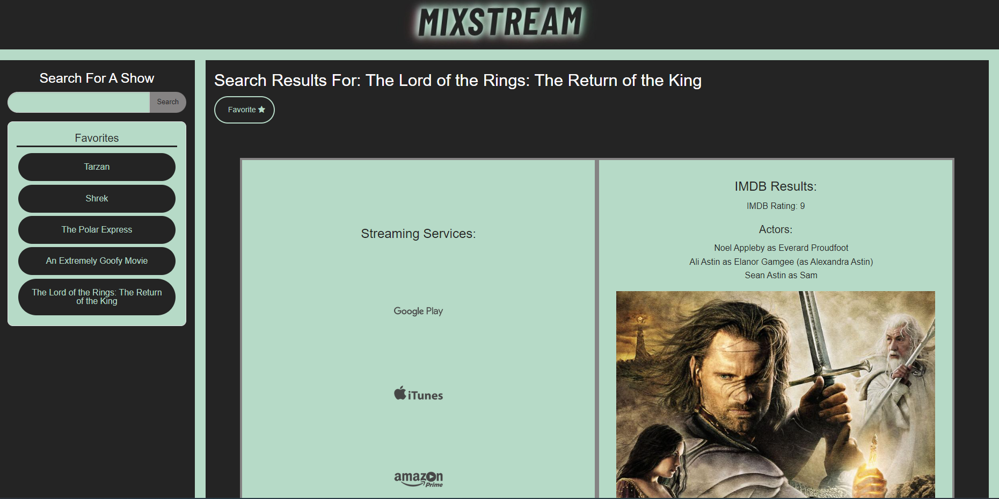

# Group Project 1

Interactive Front-End Project

## Contributors

- [Brandon B](https://github.com/bbairdgen)
- [Charlie G](https://github.com/CharlieGarvin)
- [Eva C](https://github.com/evacamino)
- [Masyn N](https://github.com/MasynNay)

## User Story

If you are a couch potato, or someone who is just looking for more information on your next binge session. This app will give you all the available streaming platforms for a searched TV Show or Movie. This application will also present you all of the given IMDB information for your searched media as well.

## Acceptance Criteria

- GIVEN I am an authenticated couch potato
- WHEN I search for a TV Show or Movie
- THEN I will see a list of available streaming platforms for the searched input
- THEN I will see available information for the input from IMDB
- WHEN I tap on the icon next to the search result
- THEN the media name is saved into local storage

## Application Demonstration

## Website Link

https://masynnay.github.io/MixStream/

## Google Slide Link

https://docs.google.com/presentation/d/11Ubr2npEPQ1hoQ48d20U4cu2rme3-IZMRrBsByYRxMs/edit#slide=id.p
